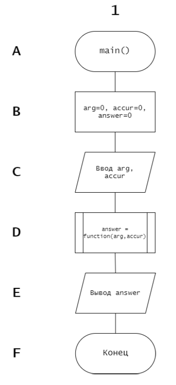
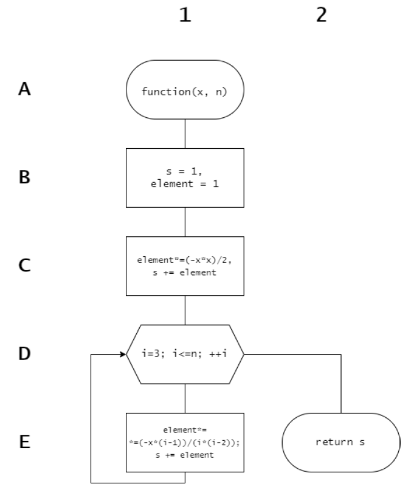
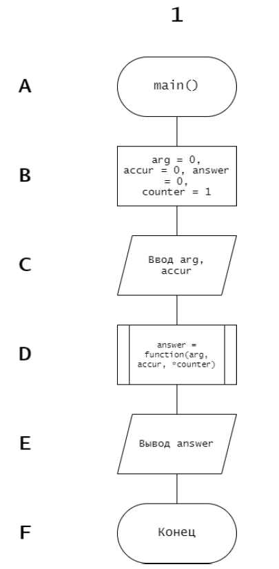
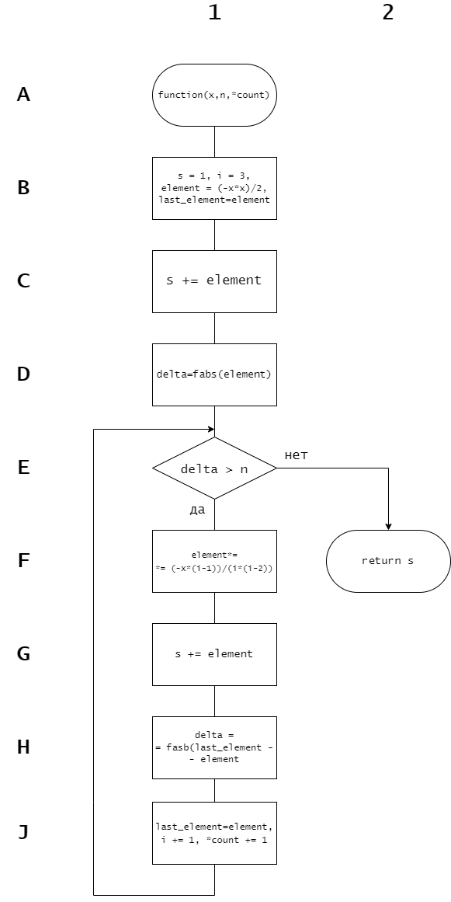

# Лабораторная работа №2  
_Вычисление значений числовых рядов и функций с заданной точностью_

---

## Постановка задачи  
**Вариант №44**

Вычислить значение функции в точке при помощи разложения в ряд:
$$(1 + x)e^{-x} = 1 + \sum_{n=2}^{\infty}\frac{(-1)^{n+1}(n-1)}{n!}x^n$$
где $|x| < \infty$.

---

## Описание решения  
### Используемые типы данных  
- `long double` - для вычислений с повышенной точностью
- `int` - для счетчиков и проверки ввода

### Алгоритм работы  
1. Ввод значения x и точности вычислений
2. Проверка корректности ввода
3. Вычисление значения функции:
   - Через заданное количество членов ряда (for)
   - До достижения заданной точности (while)
4. Сравнение с эталонным значением

#### Блок-схемы  
<table>
  <tr>
    <td>
      <figure>
        
        <figcaption>Блок-схема main (for)</figcaption>
      </figure>
    </td>
    <td>
      <figure>
        
        <figcaption>Блок-схема function (for)</figcaption>
      </figure>
    </td>
  </tr>
  <tr>
    <td>
      <figure>
        
        <figcaption>Блок-схема main (while)</figcaption>
      </figure>
    </td>
    <td>
      <figure>
        
        <figcaption>Блок-схема function (while)</figcaption>
      </figure>
    </td>
  </tr>
</table>

---

## Функции

### mainFor.c

- `function(x: long double, n: int) -> long double`
    > Вычисляет значение функции через заданное количество членов ряда
    >
    > _ПАРАМЕТРЫ:_  
    >    * **x** - Аргумент функции  
    >    * **n** - Количество членов ряда  
    >
    > _ВОЗВРАЩАЕТ:_  
    >    * Приближенное значение функции

### mainWhile.c

- `function(x: long double, accuracy: long double, count: int*) -> long double`
    > Вычисляет значение функции с заданной точностью
    >
    > _ПАРАМЕТРЫ:_  
    >    * **x** - Аргумент функции  
    >    * **accuracy** - Требуемая точность  
    >    * **count** - Указатель на счетчик итераций  
    >
    > _ВОЗВРАЩАЕТ:_  
    >    * Приближенное значение функции

### checker.h

- `check(num: int) -> int`
    > Проверяет корректность ввода целого числа
    >
    > _ПАРАМЕТРЫ:_  
    >    * **num** - Введенное значение  
    >
    > _ВОЗВРАЩАЕТ:_  
    >    * Проверенное число

- `lcheck(num: long double) -> long double`
    > Проверяет корректность ввода числа с плавающей точкой
    >
    > _ПАРАМЕТРЫ:_  
    >    * **num** - Введенное значение  
    >
    > _ВОЗВРАЩАЕТ:_  
    >    * Проверенное число

---

## Тестирование  
### Тестовые примеры (for)
| x    | Членов ряда | Результат   | Эталонное значение |
|------|-------------|-------------|--------------------|
| 4    | 15          | 0.94033     | 0.91578            |
| -3   | 30          | -40.171074  | -40.171074         |
| 0.56 | 4           | 0.891086    | 0.889446           |

### Тестовые примеры (while)
| x    | Точность   | Результат   | Итераций | Эталонное значение |
|------|------------|-------------|----------|--------------------|
| 4    | 0.001      | -0.006758   | 11       | 0.091578           |
| -3   | 0.0001     | -40.171073  | 16       | -40.171074         |
| 0.56 | 0.02       | 0.891281    | 4        | 0.889446           |

